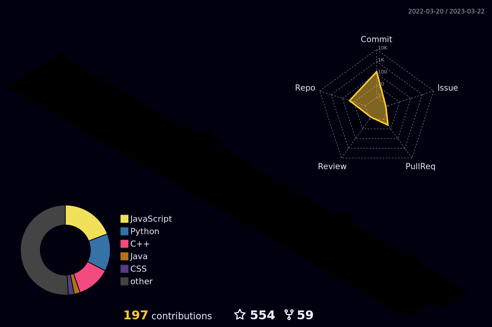

 
 
 
 

<a target="blank" href="https://profile-counter.glitch.me/leoo1992/count.svg">
❤ Número de Visitantes ❤  </a>

### Olá ! Aqui é o Léo....
### Sou um desevolvedor em aprendizado e um grande apaixonado por Tecnologia! 👋
### Prazer em ter você aqui - Seja Bem Vindo !

  
### ⚡️ Um pouquinho sobre mim:     
         

  

          Me chamo Leonardo Santos Custódio, nasci em abril de 1992, sou natural de Imbituba, Santa Catarina. Sou formado e atuo como Técnico de Segurança do Trabalho há 11 anos. Em minha jornada venho ganhando habilidades como: manuseio de sistemas, confecção e análise de gráficos, planilhas, manuais técnicos e outros materiais de apoio. Sou responsável por realizar treinamentos de integração de novos colaboradores, laudos técnicos, inspeções e adequações de irregularidades. Atualmente estou finalizando o curso de técnico em Desenvolvimento de Sistemas no SENAI de Criciúma, com formação para 07/2023. Almejo em sequência iniciar uma faculdade de Engenharia de Software e realizar uma migração de carreira, sei que tenho muito a agregar para área de tecnologia com a experiencia que possuo. Sou fascinado por sistemas e por tudo de amplo e inovador que podem transformar a nossa realidade. Meu fascínio e curiosidade podem me levar a novos lugares e alcançar grandes projetos.
  

  
## 🚀 Tecnologias que estou me Desenvolvendo:  
  

  

  
  
  
  
  
  
  
          
  

  
## 🌐 Minhas Redes Sociais
   
 

        
        
        
        

  
## ⚙️ Estatísticas GitHub</b>

  

 
 //

  <a href="https://github.com/leoo1992">
  
  

